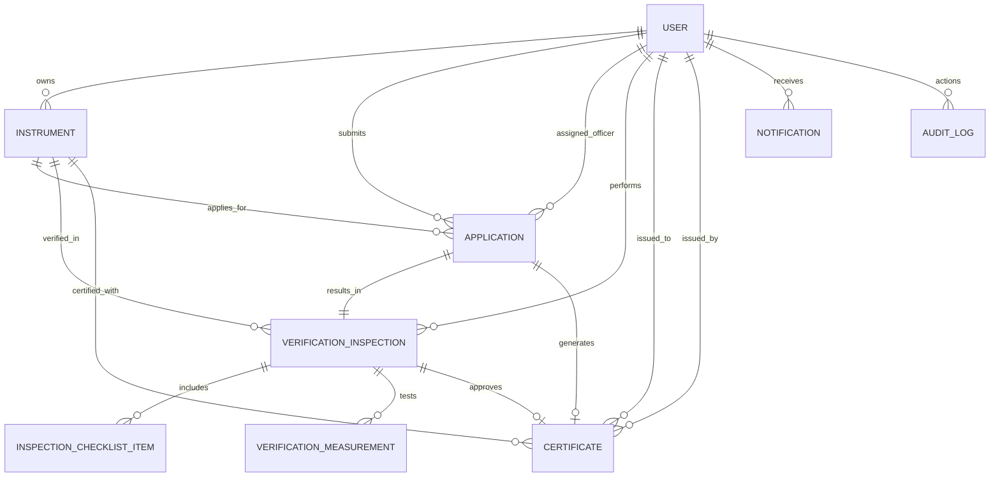

# e-Metrology – Digital Legal Metrology Verification & Certification Management System

[](https://nodejs.org/)
[](https://react.dev/)
[](https://www.typescriptlang.org/)
[](https://www.prisma.io/)
[](https://www.postgresql.org/)
[](https://tailwindcss.com/)

A secure, production-grade, full-stack digital platform for managing the statutory registration, verification, re-verification, certification, mobile field inspection, and complete lifecycle of weighing and measuring instruments under the **Legal Metrology Act, 2009** and the **Legal Metrology (General) Rules, 2011**.

---

## 🏛️ System Overview

**e-Metrology** eliminates fraudulent weights, expired stamping, paper certificate counterfeiting, and administrative bottlenecks by digitizing the entire legal metrology workflow:

1. **Digital Instrument Catalog**: Commercial users and traders register all weighing/measuring instruments with model approval numbers, serial numbers, accuracy classes, and geolocations.
2. **Online Verification & Re-verification Dossiers**: Automated application generation, document verification, and milestone progress tracking.
3. **Smart Scheduling & Allocation Engine**: Conflict-free allocation of inspections to Legal Metrology Officers (LMOs) or Government Approved Test Centres (GATC).
4. **Mobile Field Verification Suite**: Responsive, touch-optimized on-site inspection console for LMOs to perform multi-point load tests, tolerance calculations, checklist audits, photo evidence collection, and optional GPS tagging.
5. **Tamper-Evident Digital Certificates**: Instant cryptographic QR code issuance, security seal codes, and dynamic vector PDF generation.
6. **Public QR Verification Portal**: Instant smartphone validation for consumers, vigilance squads, and enforcement officers without login.
7. **Statutory Expiry Management**: Automated lifecycle tracking with 90, 60, 30, and 7-day alert notices.
8. **Directorate MIS & Immutable Audit Trails**: Comprehensive analytics, district-wise workload distribution, and CSV report exports.

---

## 👥 Demo Accounts & Credentials

The database comes pre-seeded with realistic instruments, inspection records, active certificates, and expiring certificates:

| Role | Email | Password | Scope & Authority |
| :--- | :--- | :--- | :--- |
| **Super Admin** | `admin@emetrology.gov.in` | `Password@123` | Directorate HQ: Master oversight, officer allocation, revocations, audit logs, MIS |
| **Legal Metrology Officer (LMO)** | `lmo.verma@emetrology.gov.in` | `Password@123` | South Delhi: Field inspections, accuracy load testing, pass/fail stamping, certificate issuance |
| **Legal Metrology Officer (LMO 2)** | `lmo.patel@emetrology.gov.in` | `Password@123` | Ahmedabad: District field officer |
| **GATC Testing Lab** | `gatc.delhi@emetrology.gov.in` | `Password@123` | National Calibration & Test House: High-precision & bulk volumetric lab queue |
| **Business User (Trader 1)** | `user@apollologistics.com` | `Password@123` | Apollo Logistics & Warehousing: Instruments owner, applicant, certificates holder |
| **Business User (Trader 2)** | `contact@bharatpetro.com` | `Password@123` | Bharat Petroleum Station: Fuel dispenser operator with expiring certificate |
| **Public Consumer** | *No Login Required* | *N/A* | Public verification portal (`/verify`) & application tracker (`/track`) |

> 💡 **Tip**: On the Login screen, click any of the 1-click **Quick Demo Login** buttons to immediately populate credentials.

---

## 🛠️ Technology Stack

### Frontend
- **Framework**: React 18 with TypeScript
- **Styling**: Tailwind CSS (National Government UI theme)
- **Icons**: Lucide React
- **Routing**: React Router v6 with Role-Based Protected Routes
- **Build Tool**: Vite 6

### Backend
- **Runtime**: Node.js v20+ / Express.js
- **Language**: TypeScript
- **Database & ORM**: PostgreSQL & SQLite dual-mode support via Prisma ORM
- **Authentication**: JWT (JSON Web Tokens) with 7-day expiration & bcrypt password hashing
- **Authorization**: Granular Role-Based Access Control (RBAC) middleware
- **Document Generation**: PDFKit (high-resolution statutory vector certificates)
- **QR Codes**: `qrcode` with high error correction level (Level H)
- **File Uploads**: Multer with strict MIME validation, file size limits, and sanitization
- **Security**: Helmet, CORS, Express-Rate-Limit, Zod schema validation

---

## 🚀 Quick Start (Local Development)

### Prerequisites
- Node.js (v18 or v20+)
- npm (v9+)

### 1. Clone & Setup Backend
```bash
cd backend
npm install
npx prisma generate
npx prisma db push
npx tsx prisma/seed.ts
npm run dev
```
*The backend server will start on `http://localhost:5000`.*

### 2. Setup Frontend
In a separate terminal:
```bash
cd frontend
npm install
npm run dev
```
*The frontend portal will start on `http://localhost:5173`.*

---

## 🐳 Docker Deployment (PostgreSQL + Backend + Frontend)

A complete production multi-container setup is configured in `docker-compose.yml`:

```bash
# Start PostgreSQL, Backend API, and Nginx-powered Frontend
docker-compose up --build -d
```

Services exposed:
- **Frontend Portal**: `http://localhost` (Port 80)
- **Backend API**: `http://localhost:5000`
- **PostgreSQL**: `localhost:5432` (`emetrology` database)

To run migrations and seed inside the Docker container:
```bash
docker-compose exec backend npx prisma db push
docker-compose exec backend npx tsx prisma/seed.ts
```

---

## 📂 Project Architecture & Directory Structure

```
36/
├── docker-compose.yml              # Complete 3-tier Docker deployment
├── README.md                       # Project documentation
├── backend/
│   ├── Dockerfile                  # Production container for Node.js API
│   ├── package.json
│   ├── tsconfig.json
│   ├── .env                        # Environment configurations
│   ├── prisma/
│   │   ├── schema.prisma           # Turnkey SQLite development schema
│   │   ├── schema.postgresql.prisma# PostgreSQL production schema
│   │   └── seed.ts                 # Realistic statutory seed data generator
│   ├── test/
│   │   └── api.test.ts             # Automated test suite (7/7 critical tests)
│   ├── uploads/                    # Local storage for photos and calibration PDFs
│   └── src/
│       ├── index.ts                # Express application entry point
│       ├── lib/
│       │   └── prisma.ts           # Prisma singleton
│       ├── utils/
│       │   └── token.ts            # JWT signing & verification
│       ├── middleware/
│       │   ├── auth.ts             # JWT authentication guard
│       │   ├── rbac.ts             # Role-based access control guard
│       │   ├── upload.ts           # Multer security upload handler
│       │   └── errorHandler.ts     # Centralized error handler
│       ├── services/
│       │   ├── auditService.ts     # Immutable audit log recorder
│       │   ├── notificationService.ts # In-app alerts & notifications
│       │   ├── qrService.ts        # QR code generator
│       │   └── certificatePdfService.ts # PDFKit certificate builder
│       ├── controllers/
│       │   ├── authController.ts
│       │   ├── userController.ts
│       │   ├── instrumentController.ts
│       │   ├── applicationController.ts
│       │   ├── verificationController.ts
│       │   ├── certificateController.ts
│       │   ├── dashboardController.ts
│       │   ├── publicController.ts
│       │   ├── notificationController.ts
│       │   ├── auditLogController.ts
│       │   └── reportController.ts
│       └── routes/
│           ├── authRoutes.ts
│           ├── userRoutes.ts
│           ├── instrumentRoutes.ts
│           ├── applicationRoutes.ts
│           ├── verificationRoutes.ts
│           ├── certificateRoutes.ts
│           ├── dashboardRoutes.ts
│           ├── publicRoutes.ts
│           ├── notificationRoutes.ts
│           ├── auditLogRoutes.ts
│           ├── reportRoutes.ts
│           └── uploadRoutes.ts
└── frontend/
    ├── Dockerfile                  # Multi-stage production Nginx container
    ├── nginx.conf                  # Nginx proxy and routing config
    ├── package.json
    ├── vite.config.ts
    ├── tailwind.config.js
    ├── index.html
    └── src/
        ├── main.tsx                # React entrypoint
        ├── App.tsx                 # Route declarations & role guards
        ├── index.css               # Tailwind CSS & print styles
        ├── types/
        │   └── index.ts            # TypeScript interfaces
        ├── api/
        │   └── client.ts           # Type-safe API client
        ├── context/
        │   ├── AuthContext.tsx     # Session & role state
        │   └── NotificationContext.tsx # Live notification center
        ├── components/
        │   ├── Navbar.tsx          # Government header & unread badges
        │   ├── Sidebar.tsx         # Role-tailored dashboard navigation
        │   ├── Footer.tsx          # Statutory disclaimer & helpdesk
        │   ├── DashboardLayout.tsx # Master layout wrappers
        │   ├── ProtectedRoute.tsx  # Authorization route guard
        │   ├── StatusBadge.tsx     # Color-coded compliance badges
        │   └── LoadingAndEmpty.tsx # Reusable UI feedback components
        └── pages/
            ├── LandingPage.tsx     # National e-Metrology portal homepage
            ├── LoginPage.tsx       # Auth login with 1-click demo helpers
            ├── RegisterPage.tsx    # Stakeholder registration
            ├── ForgotPasswordPage.tsx
            ├── PublicVerifyPage.tsx# Public QR certificate authenticator
            ├── PublicTrackPage.tsx # Public application lifecycle tracker
            ├── DashboardRouter.tsx # Auto-redirect to role dashboard
            ├── AdminDashboard.tsx  # Super Admin executive console & charts
            ├── LmoDashboard.tsx    # Officer field inspection roster
            ├── GatcDashboard.tsx   # Accredited testing laboratory queue
            ├── BusinessDashboard.tsx# Commercial instrument compliance portfolio
            ├── InstrumentsListPage.tsx # Master instrument directory
            ├── RegisterInstrumentPage.tsx # Instrument registration form
            ├── InstrumentDetailPage.tsx # Instrument technical dossier
            ├── ApplicationsListPage.tsx # Verification applications queue
            ├── NewApplicationPage.tsx # Verification application form
            ├── ApplicationDetailPage.tsx # Dossier details & timeline
            ├── FieldVerificationPage.tsx # Mobile touch-optimized inspection suite
            ├── CertificatesListPage.tsx # Statutory certificate repository
            ├── CertificateDetailPage.tsx # Full certificate view, PDF, print & revoke
            ├── UsersManagementPage.tsx # User moderation & approval
            ├── SettingsChecklistPage.tsx # Dynamic checklist & types configuration
            ├── AuditLogsPage.tsx   # Immutable security audit logs
            ├── ReportsPage.tsx     # CSV dataset exports
            └── NotificationsPage.tsx # Alerts & notices archive
```

---

## 🗄️ Database Schema & Entities

The system implements relational data models using Prisma:



### Key Models:
- **`User`**: Role-based accounts (`SUPER_ADMIN`, `LMO`, `GATC`, `BUSINESS_USER`), contact details, jurisdictions, and approval states.
- **`Instrument`**: Unique ID `LM-INST-YYYY-XXXXXX`, technical specs, serial number, accuracy class, capacity, location, and owner.
- **`Application`**: Application ID `LM-APP-YYYY-XXXXXX`, verification mode (`ON_SITE` / `LABORATORY`), statuses (`SUBMITTED`, `ASSIGNED`, `SCHEDULED`, `CERTIFICATE_ISSUED`, `REJECTED`), and assigned officer.
- **`VerificationInspection`**: Inspection ID `LM-INSP-YYYY-XXXXXX`, verification date, GPS coordinates, observations, result (`PASS` / `FAIL`), and photo URLs.
- **`InspectionChecklistItem`**: Checkpoint name, result (`PASS`, `FAIL`, `NOT_APPLICABLE`), and remarks.
- **`VerificationMeasurement`**: Test name, standard value, observed value, auto-calculated error, permissible error, and result.
- **`Certificate`**: Certificate number `LM-CERT-YYYY-XXXXXX`, unique QR token, security seal code, valid from/until dates, and revocation metadata.
- **`ChecklistConfig`**: Configurable checklist items managed by the administrator.
- **`AuditLog`**: System actions, entity affected, previous/new status, IP address, and timestamp.
- **`Notification`**: In-app notifications for application milestones and certificate expirations.

---

## 🔐 Security Architecture

- **Password Hashing**: BCrypt with 10 salt rounds; plaintext passwords are never stored.
- **Authentication**: Stateless JSON Web Tokens (JWT) signed with secret keys.
- **Role-Based Authorization (RBAC)**: Route-level and API-level guards enforce access privileges.
- **Tamper-Evident QR Tokens**: Public QR codes encode only a secure verification URL and opaque token—no sensitive personal information is stored inside the barcode.
- **File Upload Protection**: Multer validates MIME types (`image/jpeg`, `image/png`, `application/pdf`), enforces a 10MB limit, and sanitizes filenames.
- **Injection & XSS Defense**: Prisma parameterizes all SQL queries; React auto-escapes HTML; Helmet enforces HTTP security headers.
- **Rate Limiting**: Express-rate-limit restricts brute-force attempts to 500 requests per 15-minute window per IP.
- **Production Error Masking**: Centralized error middleware prevents database error messages or internal stack traces from leaking to clients.

---

## 🧪 Automated Testing

Run the automated test suite verifying all critical components:

```bash
cd backend
npm test
```

### Verified Test Cases:
1. `[Test 1]` User authentication & bcrypt password hashing
2. `[Test 2]` JWT token creation, signing, and verification
3. `[Test 3]` Instrument database persistence & uniqueness constraint
4. `[Test 4]` Application lifecycle, timeline tracking, and relations
5. `[Test 5]` QR code generation service (Base64 PNG URL)
6. `[Test 6]` Vector PDF certificate generation via PDFKit
7. `[Test 7]` Expiry calculation and statutory 30-day notice detection

---

## 📋 Complete Demonstration Script (Step-by-Step)

1. **Public Landing Page**:
   - Open `http://localhost:5173/`
   - Observe the government-style branding, statutory framework notices, and 5-step lifecycle diagram.
2. **Trader Verification (Business User)**:
   - Click **Login** → Select **🏢 Business User** (`user@apollologistics.com`) → Sign in.
   - You land on the **Business Dashboard** showing registered instruments and certificate countdowns.
   - Click **Register Instrument** → Enter manufacturer, model, serial number, capacity, and accuracy class → Submit.
   - Click **Apply for Verification** → Select your newly registered instrument → Submit application.
   - Note the generated Application ID (e.g. `LM-APP-2026-000105`).
   - Logout.
3. **Super Admin Review & Scheduling**:
   - Click **Login** → Select **👑 Super Admin** (`admin@emetrology.gov.in`) → Sign in.
   - View the executive dashboard with real database metrics, monthly charts, and district distribution.
   - Navigate to **All Applications** → Click the newly submitted application.
   - Click **Assign & Schedule** → Select **Anil K. Verma (LMO)**, select tomorrow's date and a time slot → Confirm.
   - Observe the application status transition to `SCHEDULED`.
   - Logout.
4. **LMO Mobile Field Inspection**:
   - Click **Login** → Select **⚖️ LMO Officer** (`lmo.verma@emetrology.gov.in`) → Sign in.
   - You land on the **Officer Dashboard** with the active inspection queue.
   - Click **Launch Field Verification →** on the scheduled application.
   - On the mobile-optimized screen:
     - Click **Tag GPS** to attach geo-coordinates.
     - Review the 8-point checklist and toggle results.
     - Inspect the load tests table: observe auto-calculated error and permissible tolerance compliance.
     - Upload or attach an inspection photo.
     - Select **PASS — ISSUE CERTIFICATE**.
     - Click **Submit & Generate Digital Certificate**.
   - Watch the celebratory confirmation screen display the newly generated Certificate Number and QR code!
5. **View & Download Digital Certificate**:
   - Click **Open & Download Certificate PDF**.
   - View the vector certificate complete with government crest placeholder, instrument specs, security seal number, validity dates, and QR code.
   - Click **Download Official PDF** to stream the PDF file.
6. **Public QR Code Authentication**:
   - Copy the Certificate Number (or click the verification link `/verify/LM-CERT-...`).
   - In an Incognito window (no login), navigate to `http://localhost:5173/verify`.
   - Paste the certificate number → Click **Verify Authenticity Now**.
   - See the green **STATUS: VALID** seal, masked serial number, and issuing officer credentials.
7. **Statutory Expiry Management**:
   - Navigate to `/certificates?status=EXPIRING_SOON` to view certificates with under 30 days of validity remaining (e.g., `LM-CERT-2025-000984`).
   - Observe notifications in the top bar.
8. **Directorate Audit Trail & Reports**:
   - As Super Admin, navigate to **Audit Trail** (`/audit-logs`) to view the complete log of actions with IP addresses and timestamps.
   - Navigate to **Statutory Reports** (`/reports`) to download CSV exports of Applications, Certificates, Verifications, and Expiries.

---

## ⚖️ Legal Disclaimer

*This software was designed and developed for the Smart India Hackathon (SIH) prototype specifications under the Legal Metrology Act, 2009 and the Legal Metrology (General) Rules, 2011. Government crests, state emblems, and statutory notices are provided for demonstration and compliance architectural purposes.*
